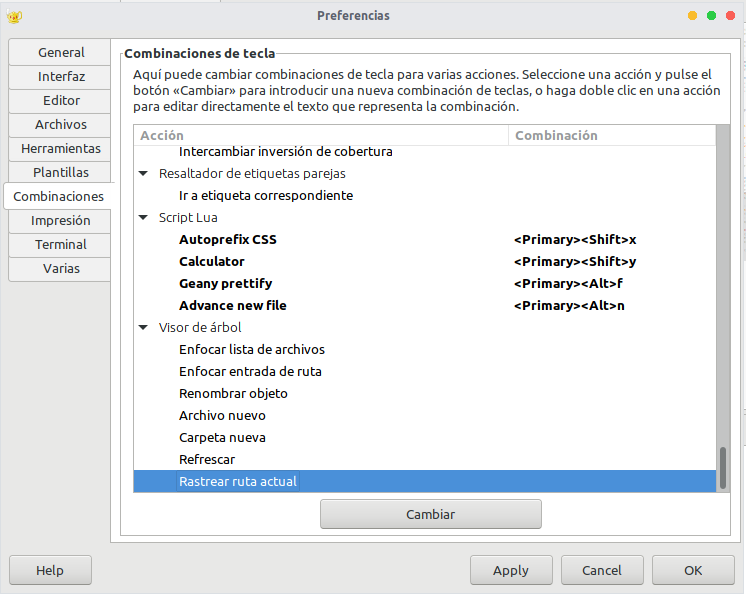

# GeanyPluginsLua

> Collection of Plugins made for the purpose of making Geany more extensible

### Requirements

[Geanylua](https://github.com/geany/geany-plugins/tree/master/geanylua)

### How to assign keystrokes to plugins

*Edit->Preferences->Keybindings*

### Install

`git clone https://github.com/diazvictor/GeanyPluginsLua.git $HOME/.config/geany/plugins/geanylua/`

`cd $HOME/.config/geany/plugins/geanylua/GeanyPluginsLua`

`mv hotkeys.cfg ../`

### License

GPL-3 <https://www.gnu.org/licenses/gpl-3.0.html>

#### Version

2.5
