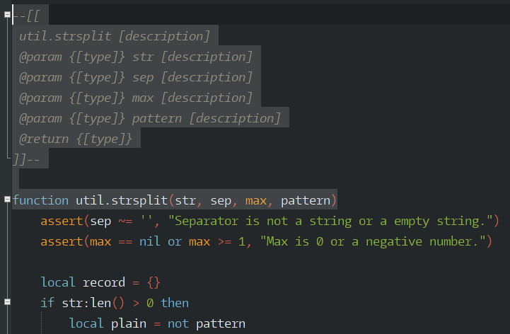

# Geany Dockblockr

> DocBlockr is a package for Geany which is designed to make writing documentation faster and easier.

The package currently supports the following languages -

* Lua

### Requirements

[geanylua](https://github.com/geany/geany-plugins/tree/master/geanylua)

### License

GPL-3 <https://www.gnu.org/licenses/gpl-3.0.html>

### Note

Based on Dockblockr from SublimeText

#### Version

2.0
